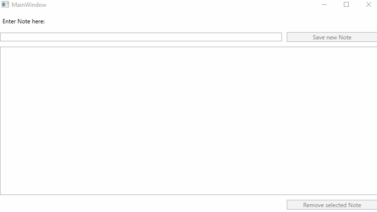

# NoteTaker App

## Overview

The **NoteTaker App** is a simple WPF application built using the **MVVM (Model-View-ViewModel)** pattern in **C#**. It allows users to manage notes with functionalities to create and delete notes. 

The app demonstrates a clean separation of concerns and adheres to best practices in WPF development.

---

## Features

- **Add Notes**: Create a new note using the provided text box and save it.
- **Delete Notes**: Remove selected notes from the list.
- **View Notes**: Display all saved notes in a list.

---

## Showcase



---

## MVVM Structure

The application is structured following the MVVM design pattern:

### **MainWindow (View)**
- The `MainWindow.xaml` contains the UI elements, such as:
  - A `TextBox` for note input.
  - A `ListBox` to display the list of notes.
  - Buttons for saving and removing notes.
- The `DataContext` is bound to the `MainViewModel`.

### **MainViewModel**
- Acts as the bridge between the `View` and the application logic.
- Contains:
  - A list of notes (`ObservableCollection<string>`).
  - The `NoteText` property for binding the user input from the `TextBox`.
  - The `SelectedNote` property for binding the user selected note from the `ListBox`.
  - Commands:
    - **`SaveNoteCommand`**: Adds a new note to the list.
    - **`RemoveNoteCommand`**: Removes the selected note.

### **Commands**
- **RelayCommand**: Implements `ICommand` to handle actions triggered by the UI.
- **SaveNoteCommand**: Adds the note in `NoteText` to the `Notes` collection.
- **RemoveNoteCommand**: Deletes the currently selected note.

---

## Installation and Usage

1. Clone this repository:
   ```bash
   git clone https://github.com/raken15/NoteTakerApp.git
   cd NoteTakerApp
   ```
2. Open the project in your preferred IDE (e.g., Visual Studio Code).
3. Build and run the application:
    - Ensure you have the .NET SDK installed.
    - Use the following command to run: 
      ```bash
      dotnet run
      ```
---

## How It Works

### Adding Notes
1. Type a note into the `TextBox`.
2. Click the "Save" button.
3. The note appears in the `ListBox`.

### Removing Notes
1. Select a note from the `ListBox`.
2. Click the "Remove" button.
3. The selected note is deleted from the list.

---

## Testing

This project includes unit tests for the `MainViewModel` class.

### Tests

- **MainViewModelTests**
  - `SaveNoteCommand_AddsNoteToList`: Verifies that when a note is saved, it is added to the `Notes` collection.
  - `RemoveNoteCommand_RemovesNoteFromList`: Verifies that when a note is removed, it is deleted from the `Notes` collection.

### Running Tests

To run the tests, open the tests in Visual Studio Code or your preferred IDE, and use the following command:
```bash
dotnet test
```
This will run all the tests in the solution and display the results in the terminal.

---

## Future Improvements
- Add persistent storage for notes (e.g., saving notes to a file or database).
- Enable editing of existing notes.
- Add categories or tags for notes.
- Improve UI design.

---

## License

This project is licensed under the MIT License. See the [LICENSE](LICENSE) file for details.
